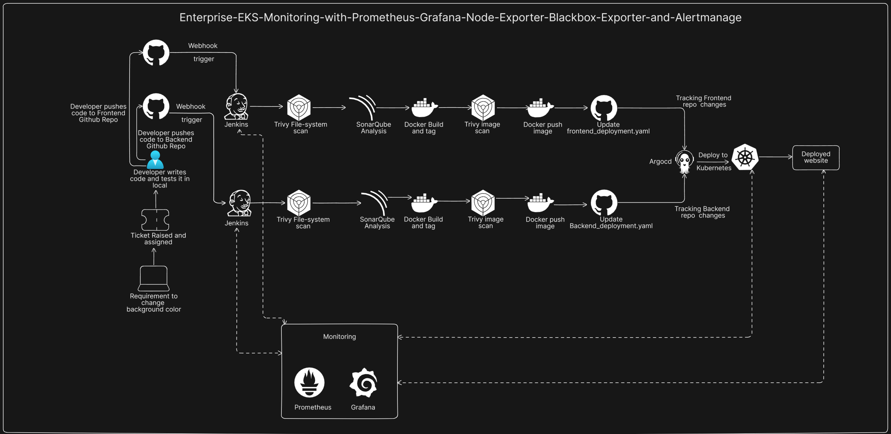

# Enterprise EKS Monitoring with Prometheus, Grafana, Node Exporter, Blackbox Exporter and Alertmanager
- [Steps to run the project](steps.md)

## Project Overview

This project focuses on building a complete monitoring and alerting setup for an Amazon EKS environment. The main goal was to create an observability stack that could monitor the health of the Kubernetes worker nodes, check the availability of important application endpoints, visualize metrics through dashboards, and send alerts when infrastructure or service conditions crossed defined thresholds.

The monitoring stack was built using Prometheus, Grafana, Node Exporter, Blackbox Exporter, and Alertmanager. This setup was designed to monitor the EKS cluster provisioned in my earlier Terraform-based project, **[Enterprise GitOps Platform: Automated EKS Infrastructure and 3-Tier Microservices](https://github.com/shashankc20mca/Enterprise-GitOps-Platform-Automated-EKS-Infrastructure-and-3-Tier-Microservices)**, along with the services running on it such as Jenkins and the application exposed through the Envoy API Gateway.

This project helped me understand how monitoring, visualization, and alerting work together in a production-style Kubernetes environment.

---

## Detailed Explanation

## Purpose of the Project

The purpose of this project was to build a dedicated monitoring system for my custom EKS platform and the workloads running on it.

In my earlier projects, I focused on infrastructure provisioning, CI/CD, GitOps, storage, security, and deployment strategies. In this project, I extended that platform by adding observability capabilities so that I could:

- monitor infrastructure health,
- collect system-level metrics from EKS worker nodes,
- track the availability of important endpoints,
- visualize metrics using dashboards,
- and receive alerts when certain thresholds were reached.

This project helped me understand that building an application platform is not complete without proper monitoring and proactive alerting.

---

## Monitoring Stack Components

The monitoring setup was built using the following tools:

- **Prometheus** for metrics collection and alert rule evaluation
- **Grafana** for dashboard visualization
- **Node Exporter** for node-level infrastructure metrics
- **Blackbox Exporter** for endpoint monitoring
- **Alertmanager** for routing alerts through email

Together, these tools formed a complete monitoring pipeline for infrastructure telemetry, synthetic endpoint checks, alerting, and visual analytics.

---

## Monitoring Architecture

I installed the core monitoring components such as **Prometheus**, **Grafana**, **Blackbox Exporter**, and **Alertmanager** as containers on the **Bastion Host**.

This created an **out-of-cluster monitoring setup**, where the monitoring stack was kept separate from the EKS worker nodes. This approach provided an independent monitoring layer for observing the private EKS infrastructure.

Since the Bastion Host was located in the same VPC as the EKS worker nodes, it could access the nodes internally over the private network.

This architecture helped me understand how monitoring systems can be deployed outside the cluster while still collecting metrics from private infrastructure securely.

---

## Node-Level Monitoring with Node Exporter

To collect infrastructure-level metrics from the EKS worker nodes, I deployed **Node Exporter** as a **DaemonSet** in Kubernetes.

Using a DaemonSet ensured that **one Node Exporter pod ran on every worker node** in the cluster. This allowed me to collect node-level metrics such as:

- CPU usage
- memory usage
- disk metrics
- system load
- network statistics

This was an important part of the monitoring architecture because it gave visibility into the health and performance of the underlying EKS nodes.

---

## Secure Metrics Exposure from Private Worker Nodes

One of the main challenges in this project was enabling Prometheus to scrape Node Exporter metrics from worker nodes that had only **private IP addresses**.

Since the EKS worker nodes were deployed in private subnets, they were not directly reachable from outside. However, because the Bastion Host was deployed in the same VPC, it could communicate with the worker nodes over the internal network.

To make this work, I configured the **EKS worker node security group** to allow requests from the Bastion Host on port **9100**, which is the default Node Exporter port.

This allowed Prometheus running on the Bastion Host to scrape node metrics securely from the private EKS nodes.

This part of the project helped me understand the importance of network design and security group configuration in observability setups.

---

## Prometheus Configuration

Prometheus was used as the central metrics collection and alert evaluation system.

Its main responsibilities in this project included:

- scraping metrics from Node Exporter
- scraping metrics from Blackbox Exporter
- storing time-series metrics
- evaluating alert rules
- sending alerts to Alertmanager

I configured Prometheus to collect metrics from the monitoring targets and also created custom alert rules to identify resource threshold violations and infrastructure health issues.

This gave me practical experience in setting up Prometheus as the core observability engine of the platform.

---

## Alerting with Prometheus and Alertmanager

After setting up Prometheus scraping, I created **alert rules** inside Prometheus based on defined metric thresholds.

These rules were used to detect situations where resource usage or infrastructure conditions crossed acceptable limits.

I then configured **Alertmanager** to receive these alerts from Prometheus and route them through **email notifications**.

This alerting pipeline allowed the system to notify when critical monitoring conditions were triggered, helping support proactive issue detection and incident response.

This part of the project helped me understand how metric-based alerting works from rule creation to alert delivery.

---

## Synthetic Monitoring with Blackbox Exporter

To monitor service availability, I used **Blackbox Exporter** for endpoint probing.

Blackbox Exporter was configured to perform **HTTP checks** for important endpoints such as:

- the **Jenkins dashboard**
- the **application endpoint exposed through the Envoy API Gateway load balancer**

This allowed me to monitor whether these endpoints were reachable and responding correctly.

By using Blackbox Exporter, I was able to add **synthetic monitoring** to the platform, which is useful because it checks services from an availability perspective rather than only from internal infrastructure metrics.

This helped me understand how endpoint monitoring complements node-level monitoring in a complete observability setup.

---

## Visualization with Grafana

For visualization, I connected **Grafana** to **Prometheus** as the data source.

I then used prebuilt dashboards for:

- **Node Exporter**
- **Blackbox Exporter**

These dashboards provided a much clearer and more user-friendly view of the collected metrics.

Using Grafana helped me present node-level health, infrastructure usage, and endpoint monitoring data in a clean graphical format that was easier to understand than raw metrics alone.

This part of the project helped me understand how dashboards are used for real-time monitoring, troubleshooting, and capacity planning.

---

## End-to-End Workflow

The overall workflow of the project was as follows:

1. Prometheus, Grafana, Blackbox Exporter, and Alertmanager were installed as containers on the Bastion Host.
2. Node Exporter was deployed on all EKS worker nodes using a DaemonSet.
3. Worker node security group rules were configured to allow the Bastion Host to access port 9100 on private nodes.
4. Prometheus was configured to scrape metrics from Node Exporter.
5. Prometheus alert rules were created based on defined infrastructure thresholds.
6. Alertmanager was configured to send alerts through email.
7. Blackbox Exporter was configured to probe the Jenkins endpoint and the application endpoint exposed through Envoy API Gateway.
8. Prometheus scraped the Blackbox Exporter probe metrics.
9. Grafana was connected to Prometheus as the metrics source.
10. Dashboards were used to visualize infrastructure and endpoint monitoring metrics.

---

## Key Features Demonstrated

This project demonstrates practical experience with:

- out-of-cluster monitoring architecture
- Prometheus-based metrics scraping
- Grafana-based dashboard visualization
- Node Exporter deployed as a DaemonSet
- monitoring private EKS worker nodes through internal VPC networking
- security group configuration for metrics scraping
- Prometheus alert rule creation
- Alertmanager email integration
- Blackbox Exporter-based endpoint monitoring
- observability for both infrastructure health and service availability

---

## What I Learned from This Project

This project helped me understand how observability is implemented for Kubernetes-based infrastructure running on AWS.

Through this project, I learned:

- how to design a monitoring architecture for private EKS infrastructure
- how Prometheus collects and stores metrics
- how Node Exporter provides node-level system telemetry
- how Blackbox Exporter can be used for synthetic endpoint monitoring
- how alert rules are created and routed through Alertmanager
- how network and security group settings affect monitoring access
- how Grafana dashboards improve visibility into infrastructure and service health

This project gave me practical exposure to monitoring, alerting, visualization, and observability design in a cloud-native environment.
